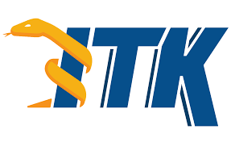

================================================
Biomedical Image Analysis and Visualization: ITK
================================================
Kitware, Carrboro, North Carolina, USA
======================================

.. image:: https://mybinder.org/badge.svg
  :target: https://mybinder.org/v2/gh/KitwareMedical/2018-05-30-KRSCourseInBiomedicalImageAnalysisAndVisualization/master

Instructors:

- Matt McCormick, PhD
- Dženan Zukić, PhD
- Francois Budin

The `Insight Segmentation and Registration Toolkit (ITK) (www.itk.org) <
https://www.itk.org>`_ has become a standard in academia and industry for
medical image analysis. In recent years, the ITK community has
focused on providing programming interfaces to ITK from Python and JavaScript
and making ITK available via leading applications such as Slicer and ImageJ.
In this course we present best practices for taking advantage of ITK in your
imaging research and commercial products. We demonstrate how script writing
and can be used to access the algorithms in ITK and the
multitude of ITK extensions that are freely available on the web.

Tutorials
---------

1. [Introduction to the Insight Toolkit (ITK)](1_Introduction_to_the_Insight_Toolkit.ipynb)
2. [Image Filtering](2_Image_Filtering.ipynb)
3. [Segmentation](3_Segmentation.ipynb)
4. [ITK and NumPy](4_ITK_and_NumPy.ipynb)
5. [Registration](5_Registration.ipynb)
6. [Extending the Toolkit](6_Extending_the_Toolkit.ipynb)
